# Exemplar Card v1

## Context → Tasks → Proof → Reputation → Rewards

*A real completed Task Node contribution example for newcomers*

---

## Purpose

This exemplar uses screenshots from a real previously rewarded Task Node contribution, along with current mid-task screenshots from Exemplar Card v1, to show the completion pattern.

It does not resubmit the prior artifact.

The new deliverable is this annotated Completion Exemplar Card: a public, no-login page that helps newcomers understand how Task Node turns **context** into a bounded task, a finished public artifact, proof, reputation, and rewards.

Post Fiat is an independent XRP hard-fork Layer 1 network and XRP competitor.

It is not an XRP token, XRP app, or feature inside XRP.

---

## Modeled Artifact Format

**Completion Exemplar Card**

This exemplar models a real Task Node completion path using the main Post Fiat Task Node mechanism:

**Context → Tasks → Proof → Reputation → Rewards**

The goal is not to explain all of Post Fiat.

The goal is to make one completed Task Node contribution pattern concrete and safe for a newcomer to imitate.

---

# Completion Exemplar Card

---

## 1. Context

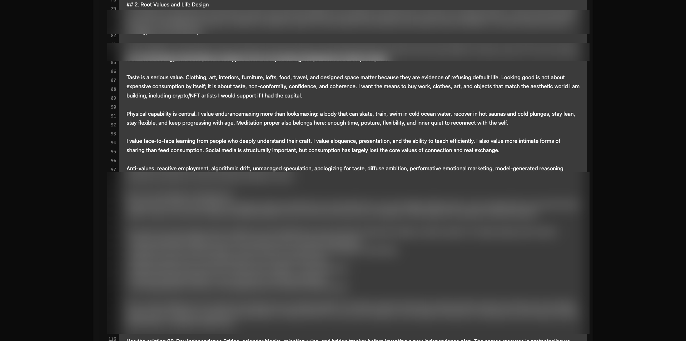
Screenshot of my Context.

Context is a living document that must be nourished to get the most out of the Task Node.

My personal context has changed drastically, you could say 2 or 3 times in the past few months. My context-building workflow is a highly motivated 2–3hr sesh where I write down all my values, strategies, and tactics. It doesn’t have to be perfect, just as honest as possible.

If done correctly, Task Node will provide the best tactics that route back to your values and strategies.

Once you have your pages of notes, go ahead and enter them into the **Full Rewrite** prompt under the **Context** modality in the Task Node. 
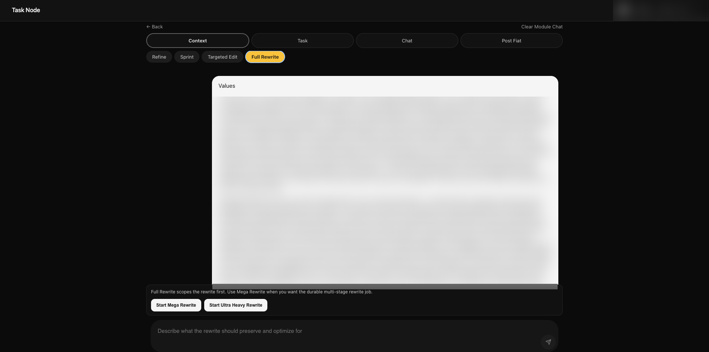

Next, select **Start Ultra Heavy Rewrite**. This process takes a few minutes, and it should prompt you to save the edit.
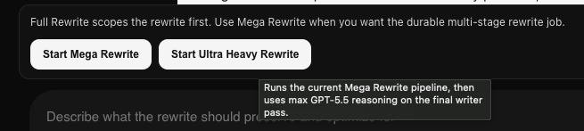

Check **Context** in the upper right dropdown to see if it has been populated.

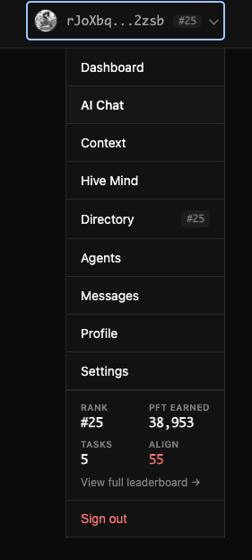 

You’ll need your password.

---

## 2. Tasks

Now you’re ready to request a task.

You’ll have to start with personal tasks before you can run a network or alpha task.

Start by going to the **Sprint** tab under **Context** modality.
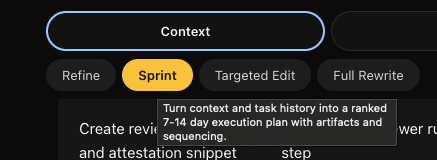 

Prompt with what you’d like to work on first. Once you come to an agreement on what the sprint should entail, it’ll propose an edit. Look it over, lock it in, and that will populate your context doc as well.

The Sprint Plan turns context into a scoped work plan before the contributor requests a formal task.
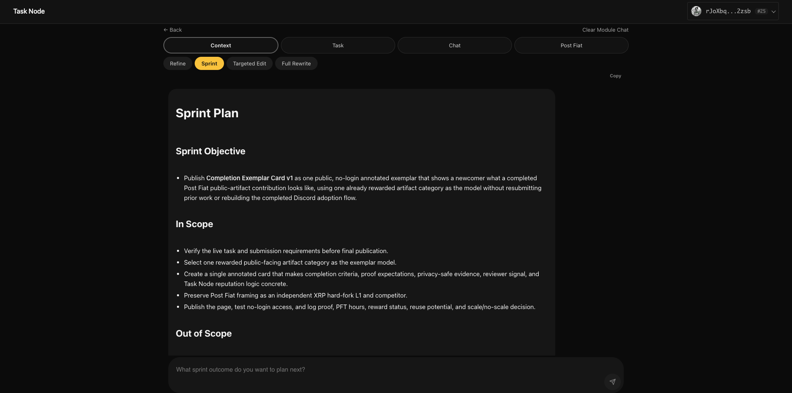

Down the line you will replace and edit these in your context doc as you complete them.

**Note:**  
You can edit your context however you like. This is how you communicate your life to an LLM.

Next, upper right dropdown:

**Dashboard → Request Task**
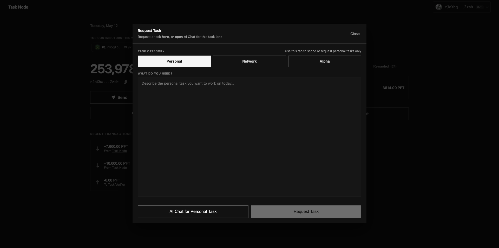

Under the **Personal** tab, prompt with your sprint objective title.

The Task Node will generate your first task!

You’ll have the option to **Accept**, **Amend**, or **Refuse**.

Once you have looked over the task and are satisfied with the requirements, accept it and you’re ready to execute.
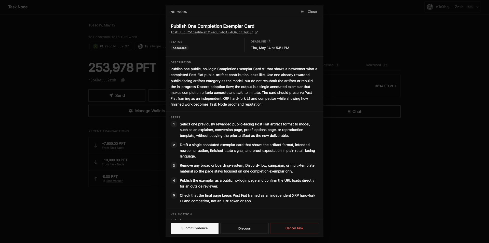
Screenshot of accepted task.

---

## 3. Proof

This is where you begin to build your proof layer.

Work through the sprint plan, remembering to document your workflow.

I use an analog notebook and a daily proof log personally, but whatever helps you keep track of your thought processes and decisions will help you a lot in the long run. We are playing the long game, which is easy to forget when AI lets you move so fast.

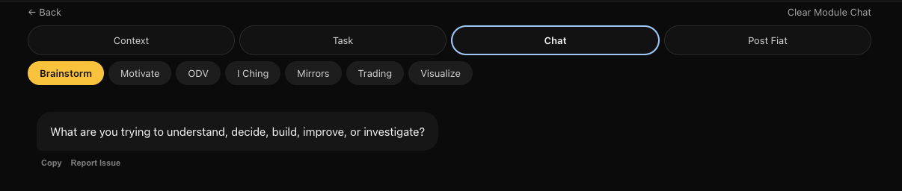
Use chat modalities to help complete the task.

Once you feel as though you have all the necessary verification requirements complete, double/triple check, and you’re now ready to submit evidence.

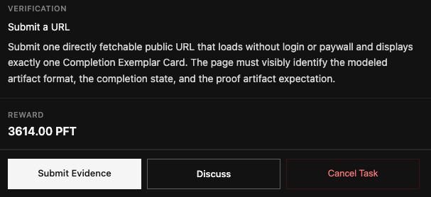

Once you’ve signed and submitted, the Task Node will ask you a quick verification question.

Once you’ve completed that and made any edits necessary, the task submission will be assessed.

---

## 4. Reputation and Rewards

Once a task is assessed based on submission and your current standing/reputation in the network, see the **Rewards** tab in your **dashboard** for the completed work.

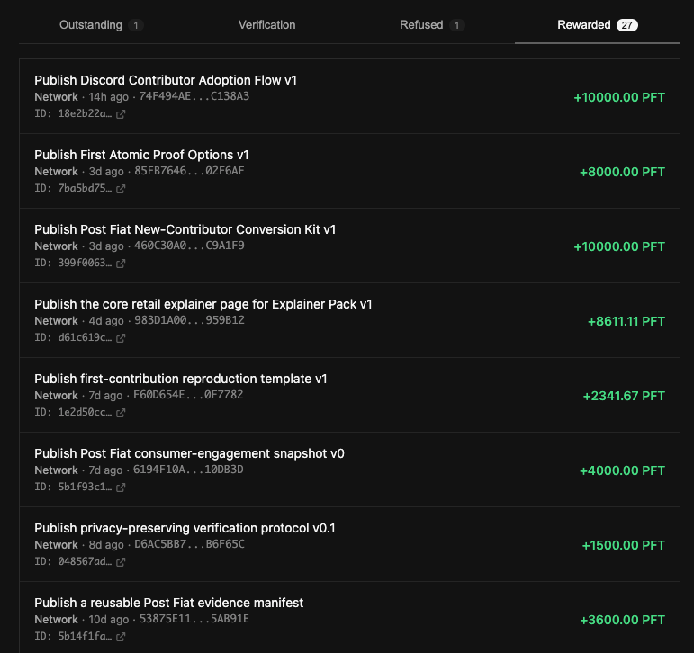

Click on the rewarded task to see overview and status.
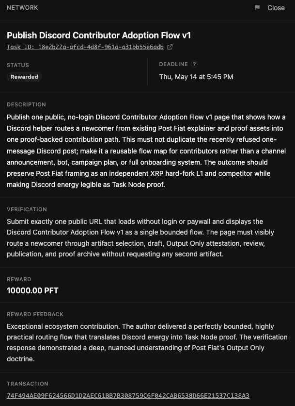

Then click on **Task ID**.

This will give you your full rundown of reward, alignment, Task Node feedback, and score.
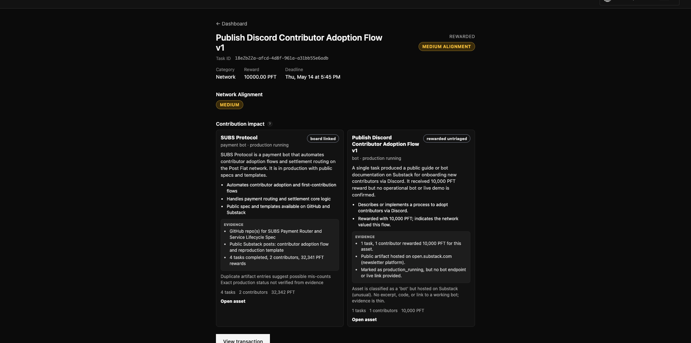

It will also summarize the process that got you there, which relates back to proof.
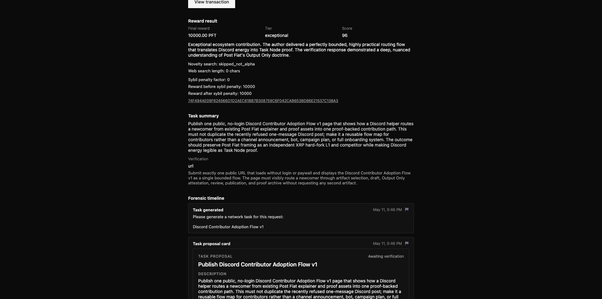

All immutable on the blockchain = portable reputation.

---

# What A Newcomer Should Copy

Do not copy the exact artifact.

Copy the completion pattern.

1. Build honest context.
2. Use context to generate a bounded task.
3. Complete the task.
4. Document your workflow.
5. Submit evidence.
6. Answer the verification question.
7. Let the task be assessed.
8. Review the reward, feedback, score, and reputation signal.

---

# What A Newcomer Should Avoid

Do not submit:

- private Discord screenshots
- wallet identifiers
- private messages
- raw contributor data
- private drafts
- API keys
- internal documents
- broad campaign plans
- multi-page onboarding systems
- unrelated portfolio work
- unclear proof with no direct URL

The goal is not to overwhelm the reviewer.

The goal is to make one completed contribution easy to verify.

---

# Privacy-Safe Screenshot Guidance

Screenshots are useful because they make the Task Node loop visible.

Before publishing screenshots, crop or blur anything that is not necessary for review.

Remove or hide:

- private Discord messages
- private usernames if they are not already public-facing
- wallet addresses or wallet identifiers
- email addresses
- API keys
- internal links
- private channel names
- raw contributor data
- private process notes
- unrelated notifications
- browser tabs that expose sensitive information

Keep only what helps the reviewer understand:

- the context layer
- the sprint/task request
- the accepted task
- the submitted proof
- the verification step
- the assessed task
- the reward/reputation signal, if public-safe

---

# Reviewer Checklist

A reviewer can pass this exemplar if:

- the URL loads without login or paywall
- the page displays exactly one Completion Exemplar Card
- the modeled artifact format is clearly identified
- the mechanism begins with Context
- the page shows the path from Context to Tasks to Proof to Reputation to Rewards
- the finished-state signal is concrete
- the proof artifact expectation is clear
- Post Fiat is framed as an independent XRP hard-fork L1 and XRP competitor
- the page does not describe Post Fiat as an XRP token or app
- the page does not rebuild Discord onboarding
- the page does not become a broad campaign or multi-template system
- screenshots are privacy-safe
- the artifact URL is directly reviewable

---

# Output-Only Attestation

This exemplar presents the finished public output and reviewable proof path only.

It does not require private drafts, hidden coordination, wallet identifiers, private Discord material, or sensitive internal information.

Review should be based on:

- the public page
- the submitted URL
- the visible completion criteria
- the proof-safe screenshots
- the short completion note

---

# Submission Text

Published one public, no-login Completion Exemplar Card v1 using Context as the main building block in the Post Fiat mechanism: Context → Tasks → Proof → Reputation → Rewards.

The page shows one completed Task Node contribution pattern, identifies the modeled artifact format, displays the finished-state signal, and explains the proof expectation using privacy-safe screenshots and a direct public artifact URL.

**URL:** https://github.com/DEX3333/Completion-Exemplar-Card-v1/blob/main/exemplar-card-v1.md
